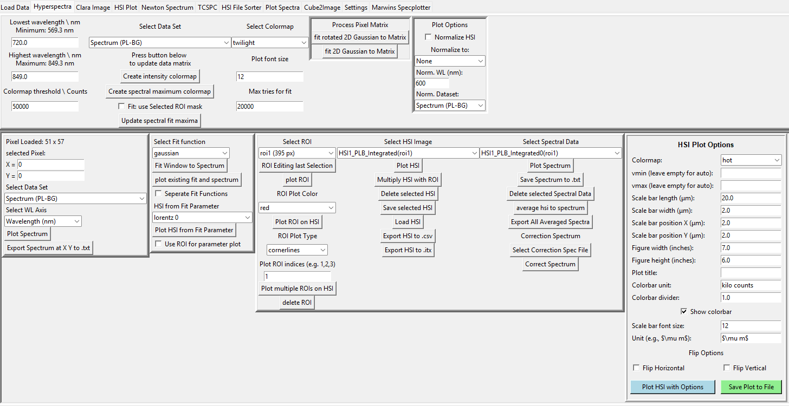
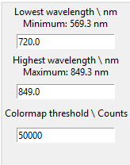
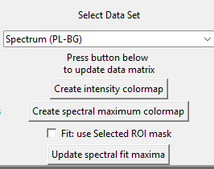
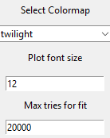
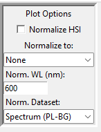
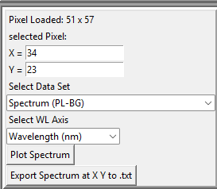
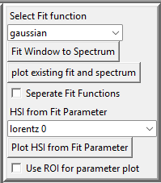
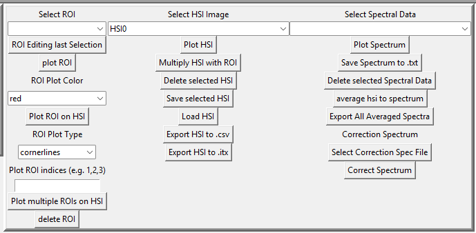
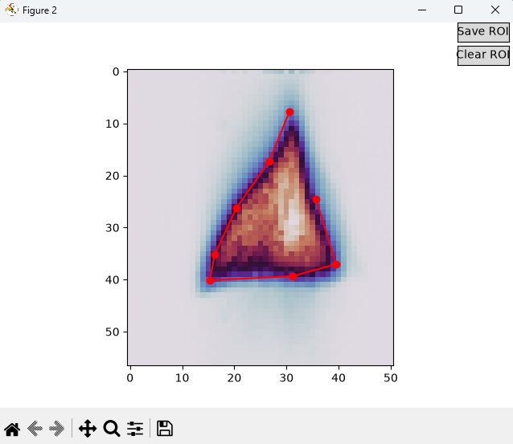
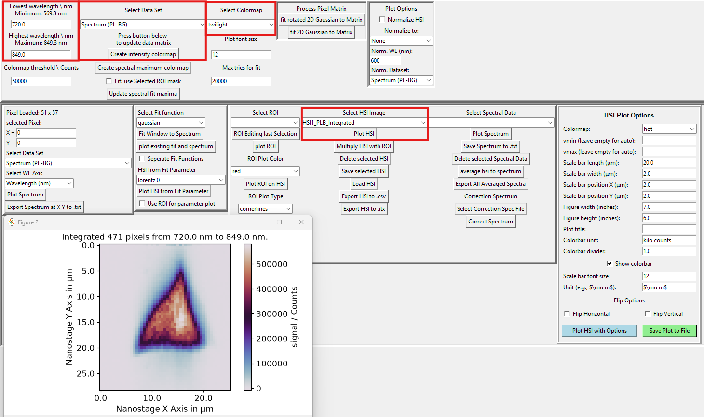

# Hypersperctra Notebook Documentation
Notebook Frame Design:

This notebook is the heart of the SpecMap software. It is used to visualize and analyze hyperspectral data. The notebook provides various tools for data manipulation, visualization, and analysis. The notebook allows users to perform tasks such as:
- Visualizing hyperspectral images as 2D Images
- Extracting spectra from selected regions
- Performing spectral analysis and classification
- Display single spectra
- Average spectra within regions of interest
- Fit spectra with predefined models and display the results of those models as 2D images. 
- export processed data and results in various formats for further analysis or reporting.

The notebook is designed to be user-friendly and intuitive, allowing users to easily navigate through the different functionalities and perform complex analyses with minimal effort. The notebook also provides options for customizing the visualization settings, such as color maps, scaling, and display options, to enhance the visual representation of the hyperspectral data.

# Description of the Notebook: What do I see?

- "Lowest Wavelength" and "Highest Wavelength" are the minimum and maximum wavelengths of the hyperspectral data, respectively. These values are used to define the range of wavelengths that will be displayed in the hyperspectral image. It defines the limits for the integraton and for the Fit of the spectra. Each HSI gets the start and end wavelength entered on the creation into its metadata. 
- "Colormap threshold \ Counts" uses the integration thresholds as fit thresholds. If a pixel-wise fit (all fits are pixel-wise) is below the threshold, no fit is carried out and the pixel obtains a np.nan value. Pixels with np.nan values are displayed white in the HSI. 

- "Select Data Set": The user can select the data set to be used for creating the hyperspectral image (HSI). The available data sets are listed in a dropdown menu, and the user can choose the desired data set for analysis. Available datasets are: the raw data, background, background subtracted data (default) and the derivatives calculated in the loading tab. 
- "Create intensity colormap" creates a HSI by integration of the selected Data Set from Lowest Wavelength to Highest Wavelength. All available HSIs are listed in the "Select HSI Image combobox". 
- "Create spectral maximum colormap" use the "Select Fit function" to fit each spectrum (respecting the Colormap threshold) and create a HSI of the spectral shift usually in nm. If the "Fit: use Selected ROI mask is True, the fit is only carried out for pixels within the selected ROI mask. If the "Fit: use Selected ROI mask is False, the fit is carried out for all pixels in the HSI. The resulting HSI will contain the fitted parameter values for each pixel, which can be used for further analysis or visualization. 
Note: this function does only update the fitparameters and displays them afterwards. If a Pixel is excluded by the ROI but a fitparameter exists (is not np.nan), it will be displayed in the HSI. If a Pixel is excluded by the ROI and no fitparameter exists (is np.nan), it will be displayed white in the HSI. To focus on the required area, multiply a ROI mask with the HSI to display only the area of interest. 
- "Update spectral fit maxima" does the same as Create spectral maximum colormap but does not carry out new fits. Just display the existing fitparameters as a HSI. 

- "Select Colormap" select the matplotlib colormpa (https://matplotlib.org/stable/tutorials/colors/colormaps.html) to be used for the HSI.
- "Plot font size" select the fontsize for the HSI.
- "Max tires for fit" select the maximum number of tires for the fit. If the fit does not converge, the number of tires can be increased.

- set the "Normalize HSI" checkbox to normalize the HSI. The normalization is done by dividing each pixel value by the maximum pixel value in the HSI. This can be useful for visualizing the relative intensity of the pixels in the HSI, especially when comparing different HSIs with different intensity ranges. Important: use "Create intensity colormap". The created HSI will then apply the selected Normalization on top of its data, so the normalization is not applied to the raw data but to the created HSI. 

Normalization methods: 
| Method | What it does | Formula per pixel | Params |
|---|---|---|---|
| `none` | No normalization — baseline/pass-through | `1.0` | — |
| `integrated_counts` | Normalizes by total signal integrated over a wavelength window (corrects for overall intensity/exposure differences) | `1 / Σ(data[wl_start:wl_end])` | `wl_start`, `wl_end`, `data_key` |
| `max_intensity` | Normalizes by the peak signal within a wavelength window (corrects for peak-height differences, e.g. across a map with varying PL intensity) | `1 / max(data[wl_start:wl_end])` | `wl_start`, `wl_end`, `data_key` |
| `counts_at_wavelength` | Normalizes by the signal at one specific wavelength (e.g. reference/calibration line) | `1 / data[closest_index_to(wavelength)]` | `wavelength`, `data_key` |
| `normalize_intern` | Special case: min-max normalization applied to the final pixel map (post-hoc, not per-spectrum) | `(pixel - min) / (max - min)` across the whole map | — |

Plot the spectrum at position X Y, selection can be entered maually or by clicking on the HSI. The spectrum is displayed in a new window. The user can select the data set to be used for plotting the spectrum. Available datasets are: the raw data, background, background subtracted data (default) and the derivatives calculated in the loading tab. To export the spectrum click "Export Spectrum at X Y to .txt". 

- To fit a spectrum, select start and end wavelength and a fit function. The fit is carried out pixel-wise for all pixels in the HSI. The resulting fit parameters are stored in the metadata of the HSI and can be used for further analysis or visualization. The user can select the data set to be used for fitting the spectrum. Available datasets are: the raw data, background, background subtracted data (default) and the derivatives calculated in the loading tab. 
- The fit is carried out for each pixel (above the threshold) with a click on "Create spectral maximum colormap". 
- To plot a single spectrum with the fit, click "plot existing fit and spectrum". This uses the selected Pixel X Y. For none-trivial functions "Seperate Fit functions" plots e g 2 gaussian peaks fromt he fit seperately. 
- To redo the Fit for one spectrum click "Fit Window to Spectrum". 
- To create a HSI of the fit parameters, click "Plot HSI from Fit Parameter" (enable "Use ROI for parameter plot" to use the selected ROI mask for the HSI).

- 3 columns, 3 comboboxes: ROIs, HSIs, Spectra
- Most important the "Select HSI Image" column. The selected HSI is used for the buttons below
    - "Plot HSI" => plot the HSI
    - "Multiply HSI with ROI" => multiply the selected HSI with the selected ROI mask and plot the result. This is useful to focus on a specific area of interest in the HSI. 
    - "Delete selected HSI" => delete the selected HSI from the list of available HSIs. The HSI is also deleted from the metadata of the data set.
    - "Save selected HSI" => save the selected HSI to a file. The user can choose the file format and location for saving the HSI. The saved HSI can be used for further analysis or visualization in other software.
    - "Load HSI" => load a previously saved HSI from a file. The user can choose the file format and location for loading the HSI. The loaded HSI will be added to the list of available HSIs in the notebook.
    - "Export HSI to .txt" => export the selected HSI to a text file. The user can choose the file format and location for exporting the HSI. The exported HSI can be used for further analysis or visualization in other software.
    - "Export HSI to .itx" => export the selected HSI to an Igor Pro .itx file. The user can choose the file format and location for exporting the HSI. The exported HSI can be used for further analysis or visualization in Igor Pro software.

- The "Select ROI" column allows the user to select a region of interest (ROI) from the list of available ROIs. The selected ROI can be used for various tasks, such as masking the HSI, fitting spectra within the ROI, and plotting spectra from the ROI. The user can also create new ROIs by selecting a region in the HSI and saving it as a new ROI.
    - "ROI Edting last Selection" => the user can select an ROI by clicking. 
    
        - click on "Save ROI" to save the selected ROI. The user can choose the name and location for saving the ROI. The saved ROI will be added to the list of available ROIs in the combobox. 
        - click on "Clear ROI" to restart the selection process. The user can select a new ROI by clicking on the HSI.
    - "Plot ROI" => plot the selected ROI as a binary mask. The ROI is displayed as a white region on a black background. The user can use this plot to visualize the selected ROI and verify its accuracy.
    - "Plot ROI on HSI" => plot the selected ROI on top of the selected HSI. The ROI is displayed as a semi-transparent overlay on the HSI. The user can use this plot to visualize the selected ROI in the context of the hyperspectral image and verify its accuracy.
    - "Plot multiple ROIs on HSI" => plot multiple selected ROIs on top of the selected HSI. The ROIs are displayed as semi-transparent overlays on the HSI. The user can use this plot to visualize multiple ROIs in the context of the hyperspectral image and verify their accuracy. Enter the indicees 1, 2, ... into the box above the button. if Nothing entered, all ROIs are plotted.
    - "delete ROI" => delete the selected ROI from the list of available ROIs. The ROI is also deleted from the metadata of the data set.

- The "Select Spectrum" column allows the user to select a spectrum from the list of available spectra. The selected spectrum can be used for various tasks, such as plotting the spectrum, fitting the spectrum, and exporting the spectrum to a file. The spectra plotted here are averaged over the selected HSI. If no Spectrum is present (empty combobox) use "average hsi to spectrum" first. Crosslink to the "Plot Spectra" Notebook: on "Refresh Data" the spectra are updated.
    - "Plot Spectrum" => plot the selected spectrum. The spectrum is displayed in a new window. The user can use this plot to visualize the selected spectrum and verify its accuracy. This will plot the spectrum, then the first and then the 2nd derivative. 
    - "Save Spectrum to .txt" => save the selected spectrum to a text file. The user can choose the file format and location for saving the spectrum. The saved spectrum can be used for further analysis or visualization in other software.
    - "Delete selected Spectral Data" => delete the selected spectrum from the list of available spectra. The spectrum is also deleted from the metadata of the data set.
    - "average hsi to spectrum" => average the selected HSI and create a new spectrum. The new spectrum is added to the list of available spectra in the combobox. The user can use this function to create a representative spectrum for a specific region of interest in the hyperspectral image. 
        Important: If the user wants to average a region, first multiply the ROI to the HSI and then average the resulting HSI to a spectrum. This will ensure that only the pixels within the selected ROI are included in the averaging process. 
    - "Export All Averaged Spectra" => export all averaged spectra to a text file. The user can choose the file format and location for exporting the spectra. The exported spectra can be used for further analysis or visualization in other software.
    - "Select Correction Spec File" => select a correction spectrum file to be used for correcting the selected spectrum. The correction spectrum is subtracted from the selected spectrum to correct for any background or baseline effects. The user can choose the file format and location for selecting the correction spectrum file. The corrected spectrum can be used for further analysis or visualization in other software.
    - "Correct spectrum" => correct the selected spectrum using the selected correction spectrum file. The corrected spectrum is displayed in a new window. The user can use this plot to visualize the corrected spectrum and verify its accuracy.

# Tasks and Functionalities
1. Create a HSI by integration: 

Create an Image that Integrates all spectra from a start wavelength to an end wavelength and displays the result as an Image. 
