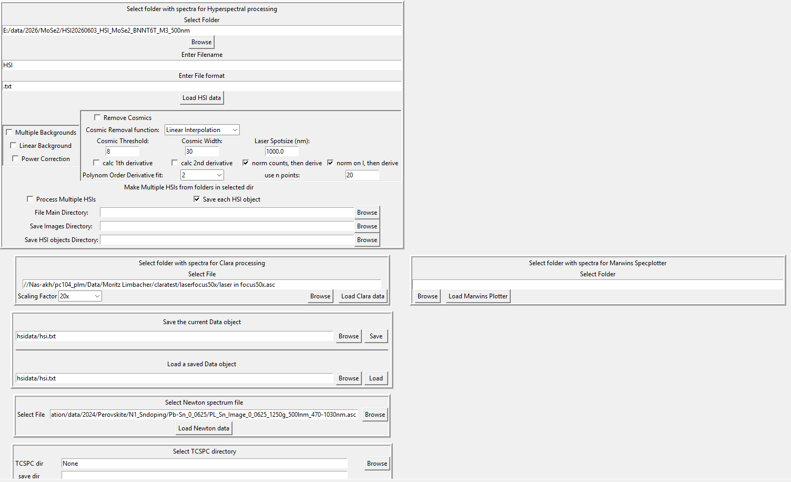

# Load Data Notebook Documentation
Notebook Frame Design:

Most of the loadings are rather self-explainatory, but there are a few things must bespecified in detail: 
- The pkl loading and saving is done using the `pickle` library, which is a standard way to serialize and deserialize Python objects. This pickeling compresses objects according to the project structure. Reloading this objects requires the same project structure as when the objects were saved. If the project structure changes, the pickled objects may not load correctly. 
- The top Notebook "Select folder with spectra for Hyperspectral processing" is the main entry point for loading data. It allows users to select a folder containing hyperspectral data files and initiate the loading process. The notebook provides options for specifying the file format, preprocessing steps, and any additional parameters required for loading the data correctly. It can be used as follows:
    - The user can specify the folder path with the Select Folder entry (Browse button below) and specify the folder for the loading. "Enter Filename" and "Enter File format" must be specified. Each loaded spectrum must contain both. Intended was to implement multiple loading functions for different file formats (and select them via a combobox but this was never implemented due to a lack of capacity). 
    - In the same Frame but below are 3 different frames to use: 
        - The Background checkboxes on the left side with the Multiple Backgrounds checkbox (currently unused wince we only measure background before the measurement), the Linear Background checkbox (set true if background is flat and contains only a linear slope + the Noise). Enable Linear Background to average the background noise if no light is present. Last But not least: Power Correction, that normalizes the Counts of each spectrum by its power. This is important if the power of the light source changes during the measurement.
        - Remove Cosmics: This frame contains a checkbox to enable or disable the removal of cosmic rays from the spectra. Cosmic rays can introduce noise and artifacts in the data, so this option allows users to clean the spectra by removing these unwanted signals. See the Cosmic Ray Removal section for more details on how this process works and the parameters that can be adjusted. All of them get Cosmic Threshold and Cosmic ray width. Those are basically just 2 parameters. the Laser Spotsize is not used currently. 
        - Below the Cosmic ray removal method there are the derivative functions. 
        - Last but not least, To process multiple HSI folders, "Process Multiple HSIs" takes a main folder with multiple subfolders. They are process iteratively and the results are saved in the same folder structure as the input. This allows for batch processing of multiple hyperspectral datasets, making it easier to handle large amounts of data efficiently and sort irrelevant datasets out. 