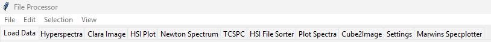
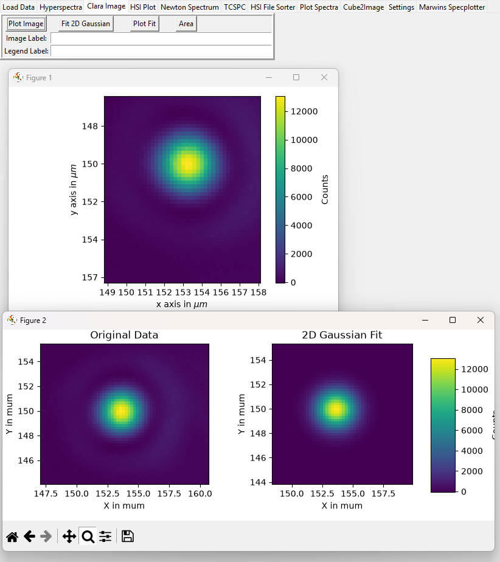
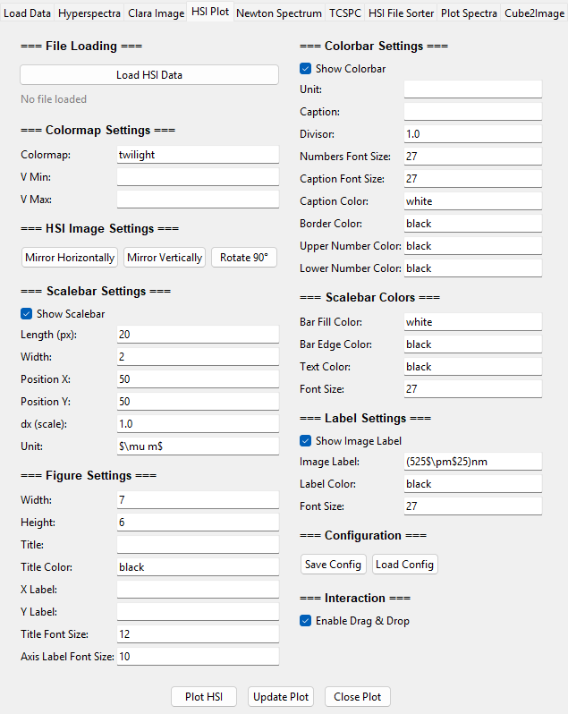
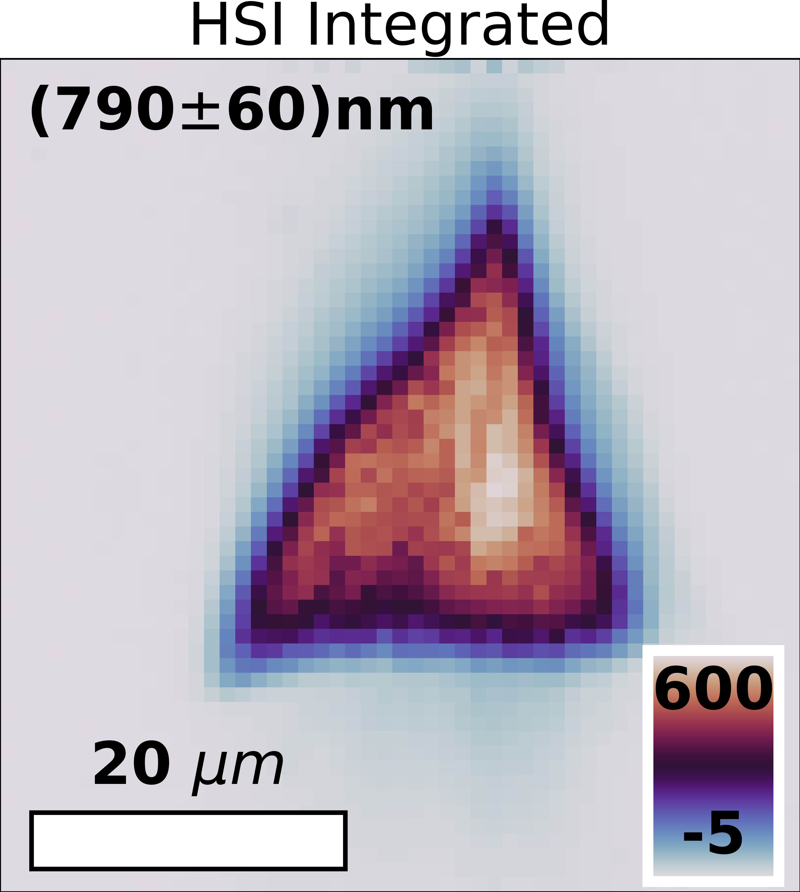
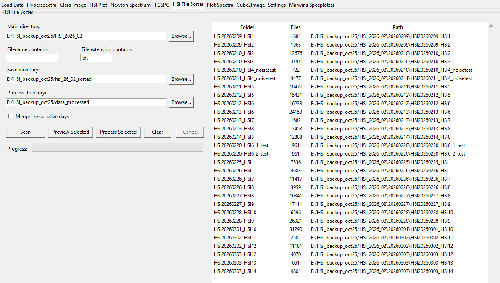
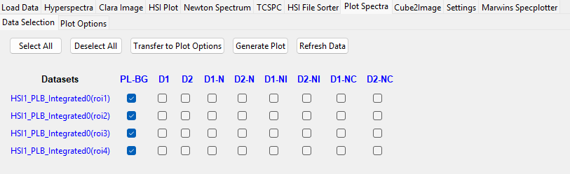
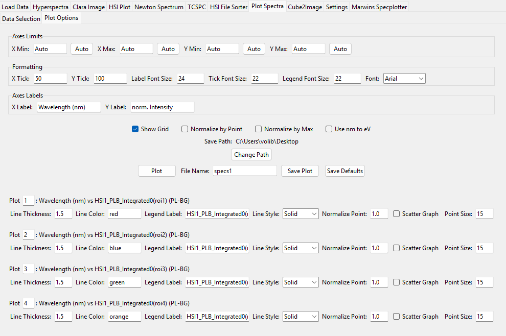
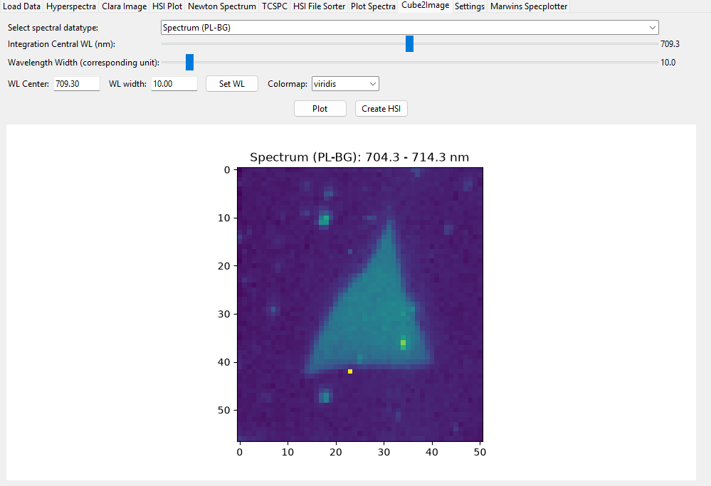
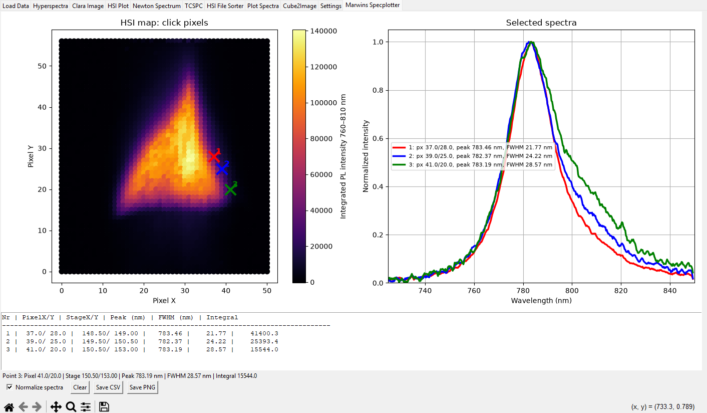

# Usage Overview
## Notebooks
Notebooks Overview:

- Load Data
- Hyperspectra
- Clara Image
- HSI Plot
- Newton Spectrum
- TCSPC
- HSI File Sorter
- Plot Spectra
- Cube2Image
- Settings
- Marwin Specplotter

## Notebook tasks:
### Load Data
Frame Design: 

- Load data from various sources: 
    - HSI data (.txt files)
    - Multiple Folders with HSI data (folders with .txt files)
    - Clara Processing Data (.asc files) exported from 2D CCD Camera
    - Save the current Data object: Save Hyperspectra Object as .pkl file
    - Load a saved Hyperspectra Object: Load a .pkl file to restore the Hyperspectra object
    - Select Newton spectrum file: load 2D Spectrum data .asc file from Newton Spectrometer
    - TCSPC data: load TCSPC data from .asc file exported from PicoQuant TCSPC software
    - Select folder with spectra for Marwinds Specplotter: load multiple spectra from .txt files for plotting in Marwinds Specplotter. Same Data as for Multiple Folders with HSI data to display the spectra of interest

    - See Load_Data_documentation for more details on the Load Data notebook.

### Hyperspectra
Frame Design:

- The heart of the SpecMap software is the Hyperspectra notebook. It is used to visualize and analyze hyperspectral data. The notebook provides various tools for data manipulation, visualization, and analysis.
- the Notebook allows users to perform tasks such as:
    - Visualizing hyperspectral images
    - Extracting spectra from selected regions
    - Performing spectral analysis and classification
    - Applying various image processing techniques
- To perform these tasks, the backend of this notebook is also connected to some of the other notebooks, such as the Load Data notebook, which allows users to load their hyperspectral data into the Hyperspectra notebook for further analysis.

- See Hyperspectra_documentation for more details on the Hyperspectra notebook.

### Clara Image
Frame Design:

- The Clara Image notebook is designed for processing and analyzing images captured by the Clara 2D CCD Camera. It provides tools for image enhancement, filtering, and analysis. Users can load images, apply various processing techniques, and extract relevant information from the images.

### HSI Plot
Frame Design:

- The HSI Plot notebook is used for visualizing hyperspectral images and spectra. It provides various plotting options and customization features to help users effectively visualize their data. Users can create plots of hyperspectral images, spectra, and other relevant data.
- Use it by exporting a HSI from the Hyperspectra notebook via the "Export HSI to .csv" button on the "Select HSI Image" tab (center column, 6th button). The exported .csv file can then be loaded into the HSI Plot notebook for visualization. To import it, just press "Load HSI Data" and select the exported .csv file. 
- Use the Buttons and entries to format, plot and update the Plot to generate a "fancy" Image. 
Use this to generate Images like this: 

### Newton Spectrum (1D Spectrum)
currently not in use.

### TCSPC 
currently not in use

### HSI File Sorter
Frame Design:

Explenation of the Task of this Notebook: 
- File Architecture tested was: 
    - Main folder: "HSI_Measurements"
        - Subfolders for each day (Nameed YYYYMMDD). Each Daily folder can contain multiple HSI measurement folders.
            - "Day1_HSI1" containing multiple Measurement folders each HSI_DATE_HSIN_M where N is the measurement number and M the spectrum, each N can have muliple M spectra.
            - "Day1_HSI2" containing multiple Measurement folders each HSI_DATE_HSIN
    - Importent note: Measurement HSI1 can go overnight, so it can be split over multiple days. In this case, the foldername changes to Date_Name where the day changes but the Name remains the same: HSIN. BUT: for the spectra Date_Name_M M walks through the measurement, so the spectra are still in order sorted by M. This explenation already shows what the Task of this Notebook is: 
    - Sort all spectra from the same measurement into the same folder. 

How2Use: 
- Select the Main folder with multiple daily subfolders where each day contains multiple HSI measurement folders.
- insert "Filename contains": (HSI or leave empty, all relevant files must contain this string in the filename) and "File extension contains": ".txt" 
- Select "Save directory" where the sorted files will be saved, on preverence empty folder.
- select "Merge consecutive days" to merge the same measurement over multiple days into one folder.
- Click Scan to fill the list of available Measurements. 
- Click on one and click "Preview Selected" to open a filebrowser with the selected one. 
- Click "Process Selected" to sort the measurement files in the folder structure as described above.

For processing and save multiple folders as Images see Load data "Process Muliple HSIs". There Set File Main Directory, Save Images Directory (where to save the Images), Save HSI objects Directory (where to save the HSI .pkl files) and click "Process Multiple HSIs". This will process all HSI measurements in the Main Directory and save the Images and HSI objects in the selected directories.

        
### Plot Spectra
Frame Design:

Explenation of the Task of this Notebook:
- Plot the spectra in Hyperspectra within the "Select Spectral Data" frame. This contains spectra of the current loaded Hyperspectra object. which are averaged Spectra of the selected HSI (can be HSI or HSI * ROI).
IMPORTANT: before using the Plot Options, go to Data Selection, press:
- "Refresh Data", then select the checkboxes what u want to plot (click on column/row names to select full row/column) and set the theckboxes for the selection. 
- If all desired spectra are selected press "Transfer to Plot Options" to transfer the selected spectra to the "Plot Options" frame.

Inside the Plot options, you can set the Plot Options, like:
- Axes Limits
- formatting
- Axes Labels

Generate a Plot on "Plot" and play around with the parameters. this should be it. 

### Cube2Image
Frame Design:

- The Cube2Image notebook is used for converting hyperspectral data cube into an 2D Image. 
- Set Dataset and move the sliders to select the desired wavelength range. 
- Click on "Create HSI" to set the exact settings to the Hyperspectra notebook and create a HSI with the selected wavelength range and dataset. 
- Note: Besides the sliders, the Center WL and WL Range can be set manually via the entires. After inserting the values, click Set WL to update the slicers and the Image. 

### Settings
Not yet implemented. Use defaults.txt instead. Note, that default values can be set in defaults.txt. See documentation/Software_Usage/Defaults.txt for more information. Typses and fallbacks are specified in deflib1.py.

# Marwins Specplotter
Frame Design:

Explenation of the Task of this Notebook:
- This notebook is used to plot multiple spectra from .txt files. The spectra can be loaded on the corresponding Load Data notebook entry. (Select the folder with the spectra as .txt files, then click "Load Marwins Plotter")

The Frame works quite simple: click on pixels ont he Image (left click) to show the spectrum. Right click to remove the spectra from the plot in the selected order. Use Normalization, Clear, Save CSV, Save PNG buttons. That is it. 